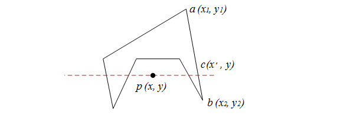

# Matrix

## 伸縮

$$
S(s_x, s_y,s_z) =
\begin{bmatrix}
s_x & 0   & 0   & 0\\
0   & s_y & 0   & 0\\
0   & 0   & s_z & 0\\
0   & 0   & 0   & 1
\end{bmatrix}
$$

## 平移

$$
T(t_x, t_y, t_z) =
\begin{bmatrix}
1 & 0 & 0 & t_x\\
0 & 1 & 0 & t_y\\
0 & 0 & 1 & t_z\\
0 & 0 & 0 & 1
\end{bmatrix}
$$

## 仿射

仿射轉換的矩陣寫法也類似：

$$
\begin{bmatrix}
x'\\
y'\\
z'\\
1
\end{bmatrix} = 
\begin{bmatrix}
a & b & c & t_x\\
d & e & f & t_y\\
g & h & i & t_z\\
0 & 0 & 0 & 1
\end{bmatrix}
\begin{bmatrix}
x \\
y \\
z \\
1
\end{bmatrix}
$$

## 旋轉

$$
R_x(\alpha) = 
\begin{bmatrix}
1 & 0           & 0            & 0\\
0 & cos(\alpha) & -sin(\alpha) & 0\\
0 & sin(\alpha) & cos(\alpha)  & 0\\
0 & 0           & 0            & 1
\end{bmatrix}
$$

$$
R_y(\alpha)=
\begin{bmatrix}
cos(\alpha)  & 0 & sin(\alpha)  & 0\\
0            & 1 & 0            & 0\\
-sin(\alpha) & 0 & cos(\alpha)  & 0\\
0            & 0 & 0            & 1
\end{bmatrix}
$$

$$
R_z(\alpha)=
\begin{bmatrix}
cos(\alpha) & -sin(\alpha) & 0 & 0\\
sin(\alpha) & cos(\alpha)  & 0 & 0\\
0           & 0            & 1 & 0\\
0           & 0            & 0 & 1
\end{bmatrix}
$$

# pnpoly

隨便定一個點，然後通過這個點水平劃一條線，數數看這條橫線和多邊形的邊相交幾次，如果是奇數，那麼該點在多邊形內，如果是偶數，則在多邊形外

假設 p 點和 ab 線相交於 c

則

# findBoundBox

直接把遍歷所有 vertex，然後把最小、最大的 x 與 y 記錄起來，就有一個矩形可以包住它了

# Sutherland_Hodgman_algorithm

遍歷裁剪窗口的每一條邊，然後依序判斷每兩個頂點(`prevPoint` 與 `currentPoint`)是不是在裁剪邊的內側，如果 `currentPoint` 在裁剪邊的內側，且 `prevPoint` 在裁剪邊的外側，則計算 `prevPoint` 和 `currentPoint` 與裁剪邊的交點，並將交點添加到 output 中。然後將 `currentPoint` 添加到 output 中。

如果 `currentPoint` 在裁剪邊的外側，且 `prevPoint` 在裁剪邊的內側，則計算 `prevPoint` 和 `currentPoint` 與裁剪邊的交點，並將交點添加到 `output` 中。

遍歷完待裁剪的多邊形的所有頂點後，將 output 複製到 input 中，然後清空 output，以便於下一次迴圈。